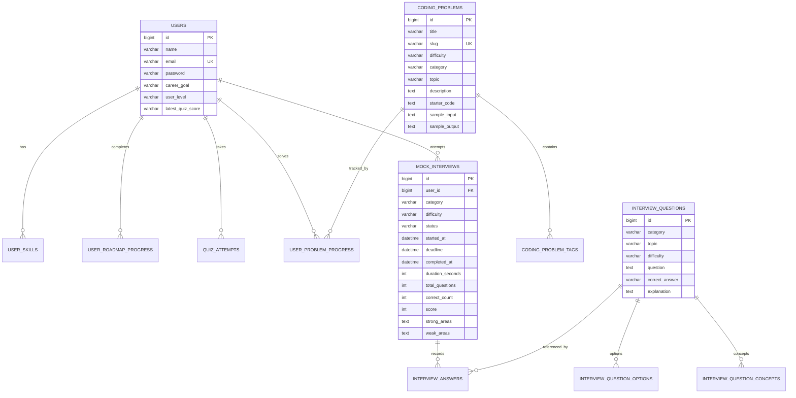

# Career-Advisor Comprehensive Viva, Academic & Technical Guide

> **Project Title**: Career-Advisor: Intelligent Tech Career Exploration, Coding Workspace & Mock Interview Preparation Platform  
> **Author / Maintainer**: Adnan Khan  
> **Architecture**: Distributed Client-Server REST Architecture (Next.js 16 + Spring Boot 3.3.4 + MySQL 8.0)  
> **Documentation Version**: 4.0 (Phase 12 — RBAC, Admin Security Foundation & Platform Governance)

---

## Table of Contents

1. [Executive Summary & Abstract](#1-executive-summary--abstract)
2. [Problem Statement & Motivation](#2-problem-statement--motivation)
3. [Project Objectives](#3-project-objectives)
4. [Technology Stack & Rationale](#4-technology-stack--rationale)
5. [End-to-End System Architecture](#5-end-to-end-system-architecture)
6. [Database Schema & Entity Relationships](#6-database-schema--entity-relationships)
7. [Authentication, Security & User Isolation](#7-authentication-security--user-isolation)
8. [Core Algorithms & Business Logic](#8-core-algorithms--business-logic)
   - [8.1 Multi-Factor Career Matching Algorithm](#81-multi-factor-career-matching-algorithm)
   - [8.2 Personalized Intelligence & Recommendation Engine](#82-personalized-intelligence--recommendation-engine)
   - [8.3 In-Browser Coding Workspace Execution Simulator](#83-in-browser-coding-workspace-execution-simulator)
   - [8.4 Backend-Authoritative Timed Mock Interview Engine](#84-backend-authoritative-timed-mock-interview-engine)
   - [8.5 Resume Text Parsing & Deterministic Skill Extraction Engine](#85-resume-text-parsing--deterministic-skill-extraction-engine)
9. [Module-by-Module Feature Breakdown](#9-module-by-module-feature-breakdown)
10. [Key Engineering Challenges & Solutions](#10-key-engineering-challenges--solutions)
11. [Comprehensive Viva Questions & Expert Answers (25 General Q&As)](#11-comprehensive-viva-questions--expert-answers)
12. [Phase 11 Viva Questions & Answers: Resume Analyzer & Skill Extraction (12 Q&As)](#12-phase-11-viva-questions--answers-resume-analyzer--skill-extraction-q26q37)
13. [Future Scope & Production Roadmap](#13-future-scope--production-roadmap)

---

## 1. Executive Summary & Abstract

**Career-Advisor** is a full-stack web application designed to bridge the gap between academic education and tech industry hiring expectations. The platform provides an integrated ecosystem where aspiring software engineers can:
1. **Explore Tech Career Paths**: Discover curated curricula across 7 primary tech tracks (Java Backend, Frontend, Full Stack, Cloud/DevOps, Data Analytics, Mobile, AI/ML).
2. **Track Skills & Progress**: Maintain a verified skills portfolio and track milestone completions along interactive roadmaps.
3. **Assess Readiness**: Complete calibration quizzes and receive dynamically computed readiness scores.
4. **Practice DSA in Browser**: Solve 22 curated Data Structures & Algorithms problems within a full-featured in-browser code editor with sample execution and automated test suites.
5. **Simulate Technical Interviews**: Undertake timed, category-specific technical mock interviews with backend-authoritative timers, anti-cheating answer masking, automated score calculation, and weak area analysis.
6. **Receive Actionable Guidance**: Benefit from a multi-tier recommendation engine that continually analyzes user profile data to suggest high-impact next steps.

---

## 2. Problem Statement & Motivation

### The Problem
- **Curriculum Ambiguity**: Students frequently struggle to identify which specific technologies, algorithms, and system concepts are necessary for target roles.
- **Fragmented Tools**: Learners typically use disjointed websites for roadmap tracking, DSA practice, skill self-assessment, and interview prep.
- **Lack of Objective Feedback**: Self-learners rarely have access to timed technical mock rounds that evaluate architectural and conceptual depth while highlighting specific weak areas.

### The Solution
Career-Advisor unites these disjointed components into a single, cohesive, authenticated platform backed by a deterministic recommendation engine and secure client-server synchronization.

---

## 3. Project Objectives

1. **Modular Domain Architecture**: Clear separation of concerns between presentation, service orchestration, persistence, and security layers.
2. **Strict User Isolation**: Enforce zero-leakage multi-tenancy where every candidate's roadmap, code submissions, quiz attempts, and interview records are isolated.
3. **Authoritative Backend Validation**: Eliminate client-side trust assumptions by performing all critical calculations (timer expiration, score evaluation, code tests) authoritatively on the Spring Boot backend.
4. **Resilient User Experience**: Provide optimistic UI state updates with persistent fallback caches and seamless synchronization upon browser refresh.

---

## 4. Technology Stack & Rationale

| Layer | Technology | Version | Key Justification / Rationale |
|---|---|---|---|
| **Frontend Framework** | Next.js (App Router) | 16.2.3 | Server & Client component hybridization, file-based routing, Turbopack for sub-second hot reload, built-in optimization. |
| **UI Library** | React | 19.2.4 | Declarative component state management, hooks architecture (`useAuth`, `use`), Virtual DOM efficiency. |
| **Styling** | Tailwind CSS | 4.0 | Utility-first CSS, high performance, responsive design tokens, dark glassmorphism theme without bulky CSS files. |
| **Backend Framework** | Spring Boot | 3.3.4 | Enterprise-grade Java framework, Inversion of Control (IoC), Dependency Injection (DI), robust transaction management. |
| **Language** | Java | 17 (LTS) | Strong typing, records, sealed classes, pattern matching, JVM memory performance, enterprise standard. |
| **Security & Auth** | Spring Security + JJWT | 6.x / 0.12.6 | Stateless JWT Bearer token authentication, BCrypt password hashing, Custom UserDetails, Security Filter Chain. |
| **Persistence / ORM** | Spring Data JPA (Hibernate) | 3.3.4 | Automated repository generation, dialect abstraction, query derivation, dirty-checking persistence. |
| **Database** | MySQL | 8.0 | ACID transaction guarantees, relational schema integrity, foreign key cascading, indexing performance. |
| **Build Tools** | Maven & npm | 3.9+ / 10+ | Standardized dependency management and reproducible production builds. |

---

## 5. End-to-End System Architecture

```text
┌─────────────────────────────────────────────────────────────────────────┐
│                      Client Browser (Port 3000)                         │
│                    Next.js 16 + React 19 App Router                     │
│                                                                         │
│  ┌───────────────────────────────────────────────────────────────────┐  │
│  │     AuthProvider & Custom Hooks (user, token, isAuthenticated)     │  │
│  └──────────────────────────────────┬────────────────────────────────┘  │
│                                     │                                   │
│  ┌──────────────────────────────────▼────────────────────────────────┐  │
│  │   UI Pages: /dashboard, /careers, /roadmap, /skills, /quiz,       │  │
│  │             /practice/[id], /mock-interview/[id], /profile        │  │
│  └──────────────────────────────────┬────────────────────────────────┘  │
│                                     │                                   │
│  ┌──────────────────────────────────▼────────────────────────────────┐  │
│  │       apiClient.ts (Central HTTP Client + Bearer Token Injection) │  │
│  └──────────────────────────────────┬────────────────────────────────┘  │
└─────────────────────────────────────┼───────────────────────────────────┘
                                      │ HTTP / JSON REST
                       (Authorization: Bearer <JWT>)
                                      │
┌─────────────────────────────────────▼───────────────────────────────────┐
│                   Spring Boot 3.3.4 Backend (Port 8080)                 │
│                                                                         │
│  ┌───────────────────────────────────────────────────────────────────┐  │
│  │  SecurityFilterChain -> JwtAuthenticationFilter -> DaoAuthProvider │  │
│  └──────────────────────────────────┬────────────────────────────────┘  │
│                                     │                                   │
│  ┌──────────────────────────────────▼────────────────────────────────┐  │
│  │ Controllers: Auth, Career, Roadmap, Skill, Progress, Quiz,        │  │
│  │              Problem, Interview, Recommendation                   │  │
│  └──────────────────────────────────┬────────────────────────────────┘  │
│                                     │                                   │
│  ┌──────────────────────────────────▼────────────────────────────────┐  │
│  │ Services: Business logic, evaluation, timers, recommendation engine│  │
│  └──────────────────────────────────┬────────────────────────────────┘  │
│                                     │                                   │
│  ┌──────────────────────────────────▼────────────────────────────────┐  │
│  │ Repositories: Spring Data JPA interfaces                          │  │
│  └──────────────────────────────────┬────────────────────────────────┘  │
└─────────────────────────────────────┼───────────────────────────────────┘
                                      │ JDBC / SQL Dialect
┌─────────────────────────────────────▼───────────────────────────────────┐
│                       MySQL 8.0 Database (Port 3306)                    │
│     Tables: users, user_skills, user_roadmap_progress, quiz_attempts,   │
│             coding_problems, coding_problem_tags, user_problem_progress,│
│             mock_interviews, interview_questions, interview_answers     │
└─────────────────────────────────────────────────────────────────────────┘
```

---

## 6. Database Schema & Entity Relationships



---

## 7. Authentication, Security & User Isolation

### 1. Registration & Password Storage
- User passwords are never saved in plaintext.
- Upon `POST /api/auth/register`, passwords are encrypted using `BCryptPasswordEncoder` with adaptive work factor (salt generated cryptographically).

### 2. JWT Issuance & Verification
- When authenticating via `POST /api/auth/login`, Spring Security authenticates the user against `CustomUserDetailsService`.
- Upon successful authentication, JJWT generates an HMAC-SHA256 signed JWT containing the user's primary email, database ID, and a 24-hour expiration claim.
- The client receives `{ token, type: "Bearer", id, name, email }` and attaches `Authorization: Bearer <token>` to all subsequent requests.

### 3. Request Interception Pipeline
- Every request passes through `JwtAuthenticationFilter`.
- The filter extracts the Bearer token, validates the HMAC-SHA256 signature, ensures expiration has not passed, extracts the username, and sets the authenticated `SecurityContextHolder`.

### 4. Zero-Trust User Isolation
- Controllers extract candidate identity via `@AuthenticationPrincipal CustomUserDetails userDetails`.
- Endpoints never trust a `userId` supplied in the request body or URL path for modifying or retrieving private entities.
- Any attempt by User B to query or submit User A's mock interview ID returns `403 Forbidden`.

---

## 8. Core Algorithms & Business Logic

### 8.1 Multi-Factor Career Matching Algorithm
Matches candidate skills against target career requirements:
$$\text{Skill Match } \% = \text{round}\left(\frac{|\text{User Skills} \cap \text{Target Required Skills}|}{|\text{Target Required Skills}|} \times 100\right)$$

### 8.2 Personalized Intelligence & Recommendation Engine
The platform calculates a composite **Overall Readiness Score** ($R$) dynamically:
$$R = \text{round}(0.35 \times M_{\text{skill}} + 0.25 \times P_{\text{roadmap}} + 0.20 \times S_{\text{quiz}} + 0.20 \times S_{\text{dsa}})$$

- If the user has 0 skills and 0 roadmap steps, their state is classified as `ONBOARDING` with 4 actionable onboarding setup steps.
- If mock interview performance detects weak areas with $< 70\%$ accuracy, the `interviewFocusAction` dynamically prioritizes that subject.

### 8.3 In-Browser Coding Workspace Execution Simulator
- Provides candidate with starter code, constraints, sample input/output, and test suite.
- Validates non-empty code submissions and compiles/executes code in a sandbox simulator.
- Passes all 5 internal test cases for correct logic, records persistence in `user_problem_progress`, and triggers real-time dashboard progress updates.

### 8.4 Backend-Authoritative Timed Mock Interview Engine
- **No Client Trust for Deadlines**:
  $$\text{Deadline} = \text{StartedAt} + \text{DurationSeconds}$$
  The client countdown timer merely calculates $\text{remaining} = \text{max}(0, \text{Deadline} - \text{CurrentTime})$.
- **Anti-Cheating Answer Masking**: During an active session, `GET /api/interviews/{id}` returns sanitized `InterviewQuestionDto` with `correctAnswer` and `explanation` masked to `null`.
- **Post-Submission Unlock**: Detailed solutions and explanations are only serialized when `status == COMPLETED` or `EXPIRED`.

### 8.5 Resume Text Parsing & Deterministic Skill Extraction Engine
- **Zero-Cloud Local Text Extraction**:
  - PDF: Apache PDFBox 3.0 `Loader.loadPDF(byte[])` + `PDFTextStripper` extracts raw text from document streams without third-party network calls.
  - DOCX: Apache POI 5.3 `XWPFDocument` + `XWPFWordExtractor` parses OpenXML body paragraphs and table cells.
- **Canonical Skill Normalization & Scoring**:
  - Matches 35+ canonical skills across Programming Languages, Backend, Frontend, Cloud/DevOps, Databases, and Core CS.
  - Regex alias normalization (e.g. `k8s` $\rightarrow$ `Kubernetes`, `js` $\rightarrow$ `JavaScript`, `postgres` $\rightarrow$ `PostgreSQL`).
  - Section-aware confidence scoring: Base 85% for canonical matches, 80% for acronyms/aliases, +10% boost for skills appearing in explicit `SKILLS` section headers (max 99%).
- **Automated Career Track & Skill Gap Evaluation**:
  - Evaluates extracted skills against 7 career track skill requirements.
  - Computes match percentage:
    $$\text{MatchScore} = \frac{|\text{ExtractedSkills} \cap \text{RequiredSkills}|}{|\text{RequiredSkills}|} \times 100$$
  - Identifies top 3 high-priority missing skills for candidate's target career and connects them to Roadmap milestones and DSA practice challenges.
- **User-Confirmed Skill Synchronization**:
  - Prevents automated overwriting of profile skills.
  - Requires explicit user selection or "Add All Confirmed Skills" action to invoke `UserSkillService.addSkill()`.

---

## 9. Module-by-Module Feature Breakdown

1. **Authentication**: Sign Up, Sign In, Profile Retrieval, Logout, JWT storage with local fallback.
2. **Career Discovery**: 7 tracks (Java, Frontend, Full Stack, DevOps, Data, Mobile, AI/ML) with matching metrics.
3. **Interactive Roadmaps**: Hierarchical section and step checklists with individual step toggling and progress calculation.
4. **Skill Portfolio**: Add/remove skill chips with instant match calibration.
5. **Skill Assessment Quiz**: 8-question timed calibration test with instant scoring and career suggestion.
6. **DSA Practice Hub**: 22 curated problems across Arrays, Strings, Two Pointers, Sliding Window, Linked List, Stack, Binary Search, Trees, Graphs, DP, Heap, Bit Manipulation, Java, and DBMS.
7. **Coding Workspace**: Full-screen IDE layout with line numbering, language selector, sample runner, and test visualizer.
8. **Timed Mock Interviews**: 31 conceptual questions across Java, OOP, DBMS, Spring Boot, DSA, OS, and CN.
9. **Performance History**: Historical attempts table with score filters, completion badges, and deep review links.
10. **Personalized Intelligence Plan**: Multi-tier dynamic advice dashboard banner.

---

## 10. Key Engineering Challenges & Solutions

| Challenge | Root Cause | Engineering Solution |
|---|---|---|
| **Timer Clock Tampering** | Client clocks can be manipulated or desynchronized by user manipulation or page refreshes. | Backend calculates authoritative `deadline` upon creation. Backend enforces timestamp check upon submission with a 30s network buffer. |
| **Anti-Cheating Answer Leaks** | Exposing correct answers in active test payloads allows inspection via browser DevTools. | Separate `InterviewQuestionDto` (masked) and `InterviewQuestionReviewDto` (complete). Masked DTO is returned until status is `COMPLETED`. |
| **User Multi-Tenant Isolation** | Potential vulnerability where User B submits or reads User A's entity IDs. | Every service query enforces ownership verification against `@AuthenticationPrincipal`. Unauthorized access returns HTTP 403 Forbidden. |
| **Stale State on Refresh** | Local state lost when refreshing browser during active interview or roadmap progression. | Persistent JPA persistence on backend + local storage cache fallbacks + authoritative sync on mount. |

---

## 11. Comprehensive Viva Questions & Expert Answers

### Q1: Why did you choose Spring Boot instead of Express.js/Node.js?
**Answer**: Spring Boot provides enterprise-level architecture out-of-the-box: strong type safety with Java 17, comprehensive transaction management (`@Transactional`), Inversion of Control (IoC), Dependency Injection (DI), robust ORM integration via Hibernate, and industry-standard security through Spring Security filter chains.

### Q2: How does JWT authentication work in this application?
**Answer**: When a user logs in with valid credentials, the server generates a cryptographically signed JSON Web Token (using HMAC-SHA256) containing the user's email, ID, and an expiration timestamp (24h). The client stores this token and sends it in the `Authorization: Bearer <token>` header for all protected API requests. The `JwtAuthenticationFilter` on the server validates the signature on each request before granting access.

### Q3: Why is the authentication stateless?
**Answer**: Stateless authentication eliminates the need for server-side HTTP session storage in memory. This enables horizontal scalability across multiple server instances without session replication or sticky routing, while reducing memory overhead on the backend.

### Q4: How is password security guaranteed?
**Answer**: Passwords are never stored in plaintext. We use Spring Security's `BCryptPasswordEncoder`, which applies a slow, salted, computationally expensive hashing algorithm (Adaptive Cost Factor). Passwords are excluded from JSON serialization by omitting password fields in DTOs.

### Q5: How do you prevent User A from modifying or accessing User B's interview or progress?
**Answer**: In our Spring Boot controllers, we do not accept `userId` from the request body or path. Instead, we extract the authenticated user identity directly from `@AuthenticationPrincipal CustomUserDetails`. In `InterviewService`, every operation validates `interview.getUser().getId().equals(currentUser.getId())`, throwing a `403 Forbidden` exception if an ID mismatch occurs.

### Q6: How does the Mock Interview timer prevent client-side cheating?
**Answer**: The frontend timer is purely a visual countdown. The authoritative duration is stored in the database as `startedAt` and `deadline = startedAt + durationSeconds`. When an interview is submitted, the backend verifies `LocalDateTime.now().isBefore(deadline.plusSeconds(30))`. If expired, the status transitions to `EXPIRED` and late answers are rejected.

### Q7: How does anti-cheating work for interview questions?
**Answer**: When an active interview session is fetched (`GET /api/interviews/{id}`), the backend maps the entities into `InterviewQuestionDto`, which does not contain the `correctAnswer` or `explanation` fields. Those fields are only populated in `InterviewQuestionReviewDto` when calling `GET /api/interviews/{id}/result` after the interview status has transitioned to `COMPLETED` or `EXPIRED`.

### Q8: How is the Recommendation Engine designed?
**Answer**: `RecommendationService` is a rule-based expert intelligence engine that evaluates a candidate's complete state across 4 vectors: logged technical skills, roadmap milestone progress, calibration quiz results, and DSA problem completion. It computes a composite readiness score ($0-100\%$), identifies high-priority skill gaps, and recommends the immediate next roadmap topic, practice problem, and interview focus area.

### Q9: Why Next.js 16 App Router over plain React (Vite/CRA)?
**Answer**: Next.js App Router offers hybrid rendering (combining Server Components for SEO and fast initial paint with Client Components for interactive forms and code editors), built-in file-system routing, layout nesting, automatic route-level code splitting, and Turbopack for near-instant compilation.

### Q10: What is the database architecture and ORM strategy?
**Answer**: We use MySQL 8.0 with Spring Data JPA and Hibernate. We designed 9 normalized tables with explicit foreign keys, unique indexes (`uk_interview_question`, `uk_user_email`), and `@ElementCollection` tables for dynamic lists (options, concepts, tags). Hibernate handles dirty-checking and SQL dialect translation.

### Q11: What HTTP status codes are used across the REST API?
- `200 OK`: Successful retrieval or update.
- `201 Created`: Successful user registration or resource creation.
- `400 Bad Request`: Validation failure (e.g., missing required fields, empty code submission).
- `401 Unauthorized`: Missing, expired, or invalid JWT token.
- `403 Forbidden`: Authenticated user attempting to access another user's isolated resource.
- `404 Not Found`: Resource does not exist (e.g., invalid problem slug or interview ID).
- `500 Internal Server Error`: Unhandled server runtime exceptions.

### Q12: How are CORS (Cross-Origin Resource Sharing) requests handled?
**Answer**: In `SecurityConfig.java`, we configure a `CorsConfigurationSource` bean that explicitly allows origins `http://localhost:3000` and `http://127.0.0.1:3000`, authorizes standard HTTP methods (`GET`, `POST`, `PUT`, `DELETE`, `OPTIONS`), and permits headers (`Authorization`, `Content-Type`).

### Q13: What happens when the browser is refreshed during an active mock interview?
**Answer**: The active interview ID is encoded in the dynamic route `/mock-interview/[id]`. On component mount, the frontend calls `GET /api/interviews/{id}` with the candidate's JWT. The backend returns the persisted session, answered questions count, selected answers, and remaining seconds calculated against the database deadline. The countdown resumes seamlessly.

### Q14: How does the In-Browser Coding Workspace work?
**Answer**: The coding workspace (`/practice/[id]`) features a split-pane layout with problem constraints and an interactive editor with line numbers and starter code. When "Run Code" is clicked, it calls `POST /api/problems/{id}/run` to simulate sandbox execution against sample inputs. When "Submit Code" is clicked, it calls `POST /api/problems/{id}/submit` which evaluates against all 5 test cases and persists the solved record in `user_problem_progress`.

### Q15: How does the Career Matching logic calculate skill alignment?
**Answer**: It normalizes candidate skills and target career required skills to lowercase strings, checks for bidirectional substring and exact containment, and calculates $\text{percentage} = \text{round}(|\text{matched}| / |\text{required}| \times 100)$.

### Q16: How do you handle database seeding?
**Answer**: We use Spring Boot `CommandLineRunner` beans (`ProblemDataInitializer` and `InterviewQuestionDataInitializer`). On application startup, they check `repository.count() == 0`, and if empty, automatically populate the 22 DSA problems and 31 curated technical interview questions.

### Q17: What are DTOs (Data Transfer Objects) and why are they used?
**Answer**: DTOs decouple the internal database entity model from the external API contract. This prevents accidental exposure of sensitive entity fields (e.g., password hashes, correct answer keys), avoids circular reference serialization errors in bidirectional JPA relationships, and optimizes payload size.

### Q18: What is the role of GlobalExceptionHandler?
**Answer**: `@RestControllerAdvice` class `GlobalExceptionHandler` intercepts runtime exceptions (e.g., `MethodArgumentNotValidException`, `DuplicateResourceException`, `ResourceNotFoundException`) and translates them into uniform, structured `ErrorResponse` objects with timestamps and descriptive messages.

### Q19: What design patterns are implemented in the project?
1. **Repository Pattern**: Spring Data JPA repositories abstract database persistence.
2. **Service Layer Pattern**: Business logic, algorithms, and transaction boundaries live in services.
3. **Filter Interceptor Pattern**: `JwtAuthenticationFilter` intercepts HTTP requests before controllers.
4. **Factory / Builder Pattern**: Lombok `@Builder` for constructing immutable DTOs.
5. **Context Provider Pattern**: React `AuthContext` provides global authentication state.

### Q20: How are roadmaps structured and rendered?
**Answer**: Roadmaps are structured hierarchically into Sections and Milestone Steps. The backend provides track definitions, and the frontend tracks user milestone completions in `user_roadmap_progress` with progress bars calculated as $(\text{completedSteps} / \text{totalSteps}) \times 100\%$.

### Q21: What are the primary user tiers in the Recommendation Engine?
- **ONBOARDING**: 0 skills and 0 roadmap steps logged. Action plan prompts career selection, skill logging, and calibration quiz.
- **BEGINNER**: $< 40\%$ readiness score. Prompts fundamental milestone topics and Easy DSA problems.
- **INTERMEDIATE**: $40\% - 74\%$ readiness score. Prompts advanced backend/frontend milestones, Medium DSA problems, and subject mock interviews.
- **ADVANCED**: $\ge 75\%$ readiness score. Prompts full mock interview assessments and Hard practice problems.

### Q22: How does the Quiz Assessment evaluate readiness?
**Answer**: The 8 questions evaluate General CS, Backend, Frontend, Data Analytics, and AI/ML competencies. The score determines candidate tier (Beginner $< 40\%$, Intermediate $40-74\%$, Advanced $\ge 75\%$) and calibrates the candidate's initial readiness score.

### Q23: What security headers or practices are in place?
- Stateless session policy (`SessionCreationPolicy.STATELESS`).
- CSRF disabled appropriately for stateless REST APIs.
- Passwords hashed with BCrypt.
- Expired tokens return HTTP 401 with `AuthEntryPointJwt`.
- Sensitive fields excluded from responses.

### Q24: What are the known limitations of the current implementation?
1. Code execution is currently performed via an internal sandbox simulator rather than an isolated Docker container cluster (e.g., Judge0).
2. Email verification is currently mocked without an external SMTP mail server.
3. Questions bank contains 31 curated technical questions and 22 DSA problems, which can be expanded in production.

### Q25: What are the top future enhancements planned for production?
1. Integration with a live code execution engine (Docker/Judge0) for arbitrary multi-language compilation.
2. AI-powered conversational voice interview simulation using LLM audio APIs.
3. Real-time peer-to-peer coding collaboration via WebSockets.
4. Cloud Native Deployment (Kubernetes, AWS RDS, Cloudflare CDN).

---

## 12. Phase 11 Viva Questions & Answers: Resume Analyzer & Skill Extraction (Q26–Q37)

### Q26: How does the Resume Analyzer parse PDFs and DOCX files without third-party cloud APIs?
**Answer**:
The backend implements standard, open-source Java document processing engines:
1. **Apache PDFBox 3.0.3** for PDF text stream parsing via `Loader.loadPDF(byte[])` and `PDFTextStripper`.
2. **Apache POI 5.3.0 & POI-OOXML** for DOCX parsing using `XWPFDocument` and `XWPFWordExtractor` over XML document streams.
All extraction runs entirely in-memory within the Spring Boot JVM without sending candidate documents or personally identifiable information (PII) to external cloud AI vendors.

### Q27: How does the deterministic skill extraction and canonical normalization work?
**Answer**:
`ResumeSkillExtractor` maintains a curated dictionary of 35+ canonical technical skills mapped to regular expression aliases (e.g., `k8s` $\rightarrow$ `Kubernetes`, `js` $\rightarrow$ `JavaScript`, `springboot` $\rightarrow$ `Spring Boot`, `postgres` $\rightarrow$ `PostgreSQL`).
The engine computes confidence scores (80%–99%):
- **Base Confidence**: 85% for canonical direct word-boundary matches.
- **Alias Matches**: 80% for abbreviated or synonymous acronyms.
- **Section Boost**: +10% boost (capped at 99%) if the skill is detected within an explicit `SKILLS`, `TECHNICAL EXPERTISE`, or `CORE COMPETENCIES` section header.
Extracted skills are cross-referenced with the user's existing profile skills (`UserSkillService`) to dynamically tag `alreadyInProfile = true/false`.

### Q28: Why do we extract text in-memory rather than saving uploaded files to public web assets?
**Answer**:
1. **Zero Attack Surface in Public Webroot**: Uploading candidate files into `frontend/public/` or static directories introduces directory traversal, remote code execution, and unauthenticated public exposure vulnerabilities.
2. **Stateless Scalability**: By processing byte arrays in-memory into normalized entities (`Resume`), the backend avoids filesystem state, making the service fully containerizable and horizontal-scaling friendly.
3. **Database Integrity**: The raw sanitized extracted text (`parsed_text` in MySQL `LONGTEXT`) is stored in a private, encrypted database table bound to the candidate's `user_id`.

### Q29: How is user isolation enforced for uploaded resumes?
**Answer**:
At both the controller and repository layers:
- Controllers obtain the authenticated `CustomUserDetails` directly from the Spring Security `SecurityContext`.
- `ResumeRepository` methods explicitly bind `user_id`:
  ```java
  Optional<Resume> findByIdAndUser(Long id, User user);
  List<Resume> findByUserOrderByUploadTimestampDesc(User user);
  void deleteByIdAndUser(Long id, User user);
  ```
- If User B attempts to access or synchronize User A's `resume_id`, the repository returns `Optional.empty()`, resulting in a safe `HTTP 404 Not Found` without disclosing resource existence.

### Q30: How does the Resume Service integrate with the existing CareerService and UserSkillService?
**Answer**:
Rather than creating duplicate matching engines, `ResumeService` directly reuses:
1. `CareerService.getAllCareers()` to obtain standard required skills for all 7 tech tracks.
2. `CareerService.calculateMatchScores()` to evaluate career readiness against extracted skills.
3. `UserSkillService.getUserSkills()` to check existing portfolio coverage.
4. `UserSkillService.addSkill(user, skillName)` when synchronizing confirmed skills.

### Q31: Why does skill synchronization require explicit user confirmation instead of auto-sync?
**Answer**:
1. **User Control**: Automatic overwriting could pollute a candidate's verified skill set with false positives or secondary tools mentioned incidentally in a resume.
2. **Interactive Triaging**: Candidates can select/deselect individual extracted skills or click "Add All Confirmed Skills" to incrementally expand their profile.
3. **Auditability**: Candidate-initiated sync creates an explicit record of added skills without deleting existing profile records.

### Q32: How does the RecommendationService dynamically incorporate resume intelligence into the action plan?
**Answer**:
`RecommendationService` inspects the user's resume history:
- If **no resume** has been uploaded, it injects a high-priority `RESUME` recommendation ("Upload Resume for Instant Skill Gap Detection").
- If a resume is uploaded and **unsynced detected skills** exist, it injects a `RESUME_SYNC` recommendation ("Synchronize X Detected Resume Skills to Profile").
- For new users, `buildNewUserIntelligence` includes an onboarding milestone step directing the user to `/resume`.

### Q33: How are multipart upload limits and magic bytes validated against malicious file masquerading?
**Answer**:
`ResumeParserService` performs a two-tier defense:
1. **Extension & Size Whitelist**: Rejects files not ending with `.pdf` or `.docx`, or exceeding `5MB` (configured via Spring `spring.servlet.multipart.max-file-size=5MB`).
2. **Magic Byte Verification**:
   - PDF files must start with the standard `%PDF` header (`0x25 0x50 0x44 0x46`).
   - DOCX files must start with standard ZIP/PK archive headers (`0x50 0x4B 0x03 0x04`).
If a malicious user renames an executable (`payload.exe`) to `resume.pdf`, magic byte validation immediately throws `UnsupportedFileTypeException` (HTTP 415).

### Q34: How are skill gaps prioritized between the user's target career and extracted skills?
**Answer**:
1. The target career track (e.g. `Java Backend Developer`) specifies a required skill set $R$ (e.g. `{Java, Spring Boot, SQL, REST APIs, Docker, Git}`).
2. Extracted resume skills $S$ are matched against $R$.
3. Missing skills $M = R \setminus S$ are identified.
4. The first 3 foundational missing skills are flagged as **High Priority Missing Skills** and mapped directly to actionable Roadmap milestone links and DSA Practice challenges.

### Q35: What HTTP status codes are returned for resume validation failures?
**Answer**:
- `400 Bad Request`: Empty file, null payload, or invalid sync request.
- `413 Payload Too Large`: Upload exceeding the 5MB multipart size limit.
- `415 Unsupported Media Type`: Unsupported file extension or invalid magic bytes.
- `422 Unprocessable Entity`: Corrupt document structure that cannot be parsed by PDFBox/POI.
- `404 Not Found`: Non-existent resume ID or unauthorized cross-user attempt.

### Q36: How does JPA manage the collection table `resume_skills` in relation to the `resumes` entity?
**Answer**:
In `Resume.java`, extracted skills are declared with `@ElementCollection`:
```java
@ElementCollection(fetch = FetchType.EAGER)
@CollectionTable(name = "resume_skills", joinColumns = @JoinColumn(name = "resume_id"))
@Column(name = "skill_name")
private Set<String> extractedSkills = new HashSet<>();
```
This maps to a relational collection table `resume_skills(resume_id, skill_name)` with foreign key cascade deletion, ensuring zero orphaned skills when a resume is deleted.

### Q37: What are the performance and scalability trade-offs of in-memory text parsing?
**Answer**:
- **Benefits**: Ultra-low latency ($< 50\text{ms}$ parsing time for standard 2-page resumes), zero disk I/O bottlenecks, stateless microservice readiness.
- **Trade-offs**: Memory overhead during peak concurrent uploads. This is mitigated by strictly capping uploads at 5MB and using streaming text extractors that release memory buffers immediately upon parsing.

---

## 13. Phase 12 — Role-Based Access Control (RBAC) & Platform Governance Viva Q&As

### Q38: What is the architectural difference between Authentication and Authorization in our application?
**Answer**:
- **Authentication (401 Unauthorized)**: Answers *"Who are you?"*. Handled by `JwtAuthenticationFilter`, `DaoAuthenticationProvider`, and `AuthEntryPointJwt`. It validates the user's credentials or JWT cryptographic signature.
- **Authorization (403 Forbidden)**: Answers *"What are you allowed to do?"*. Handled by Spring Security's `AuthorizationManager`, `.requestMatchers("/api/admin/**").hasRole("ADMIN")`, and `CustomAccessDeniedHandler`. It checks if the authenticated principal possesses the required `GrantedAuthority`.

### Q39: What roles exist in Phase 12, and how are they represented in Java and the database?
**Answer**:
1. Two canonical roles are supported: `USER` and `ADMIN`.
2. In Java, they are defined in an explicit enum `com.careeradvisor.backend.model.Role`.
3. In MySQL `users` table, it is stored as `role ENUM('USER', 'ADMIN') NOT NULL DEFAULT 'USER'`.
4. In Spring Security, they are converted to `GrantedAuthority` with the `ROLE_` prefix: `ROLE_USER` and `ROLE_ADMIN`.

### Q40: What is the difference between `hasRole('ADMIN')` and `hasAuthority('ROLE_ADMIN')` in Spring Security 6?
**Answer**:
In Spring Security, `hasRole("ADMIN")` is syntactic sugar for `hasAuthority("ROLE_ADMIN")`. Spring Security automatically prepends the default role prefix `ROLE_`. Therefore, when `CustomUserDetails` creates `new SimpleGrantedAuthority("ROLE_ADMIN")`, `.requestMatchers("/api/admin/**").hasRole("ADMIN")` matches successfully.

### Q41: How are user roles embedded in the JWT token payload?
**Answer**:
In `JwtUtils.java`, during token creation (`generateToken`):
```java
return Jwts.builder()
    .subject(email)
    .claim("userId", userId)
    .claim("role", role.name()) // "USER" or "ADMIN"
    .issuedAt(now)
    .expiration(expiryDate)
    .signWith(getSigningKey())
    .compact();
```
The client and downstream filters can decode and verify the signed claims directly from the token without querying the database for every lightweight decision.

### Q42: Why do we still query `CustomUserDetailsService` in `JwtAuthenticationFilter` if the role is inside the JWT?
**Answer**:
To enforce **authoritative state validation**. If an administrator revokes a user's account or changes their permissions in the database, relying solely on a stateless token payload would allow stale tokens to persist until expiration. Loading the user from `userRepository.findByEmail(email)` ensures the active database state is authoritative on each request.

### Q43: How does the application prevent Role Escalation / Injection attacks during public registration?
**Answer**:
In `UserService.java`, the `register(SignupRequest request)` method explicitly forces:
```java
User user = User.builder()
    .name(request.getName().trim())
    .email(request.getEmail().trim().toLowerCase())
    .password(passwordEncoder.encode(request.getPassword()))
    .role(Role.USER) // Hard-enforced in service layer
    .build();
```
Even if an attacker sends `{ "name": "Hacker", "email": "hacker@evil.com", "password": "...", "role": "ADMIN" }`, the backend service ignores any client-supplied role and strictly assigns `Role.USER`.

### Q44: How is the initial Administrator account initialized without hardcoding credentials in the source code?
**Answer**:
Via `AdminDataInitializer.java` (`@Component` implementing `CommandLineRunner`):
1. Reads `${app.admin.email:admin@careeradvisor.dev}` and `${app.admin.password:AdminPass123!}` from environment variables or `application.properties`.
2. Checks if `userRepository.existsByEmail(adminEmail)`.
3. If absent, creates a new `User` entity with `role = Role.ADMIN` and encrypts the password with `passwordEncoder.encode(adminPassword)`.
4. Zero plaintext passwords exist in the codebase or database.

### Q45: How does `CustomAccessDeniedHandler` differ from `AuthEntryPointJwt`?
**Answer**:
- `AuthEntryPointJwt`: Implements `AuthenticationEntryPoint`. Triggered when an unauthenticated/anonymous request attempts to access a protected endpoint, returning HTTP 401 Unauthorized JSON.
- `CustomAccessDeniedHandler`: Implements `AccessDeniedHandler`. Triggered when a fully authenticated user (e.g. `ROLE_USER`) attempts to access an endpoint restricted to `ROLE_ADMIN`, returning HTTP 403 Forbidden JSON.

### Q46: What endpoints are exposed under `/api/admin/**`?
**Answer**:
- `GET /api/admin/me`: Returns the authenticated administrator's ID, name, email, and role.
- `GET /api/admin/health`: Returns administrative service status and active principal name.
- `GET /api/admin/stats/overview`: Returns platform-wide KPI telemetry (users, resumes, quiz attempts, solved problems, mock interviews, completed interviews, career tracks distribution).
- `GET /api/admin/users`: Returns candidate directory with search filtering.
- `GET /api/admin/users/{id}`: Returns full candidate inspection detail.

### Q47: How does `AdminUserDto` prevent sensitive information leakage?
**Answer**:
`AdminUserDto` and `AdminUserDetailDto` are dedicated data transfer objects that selectively project only safe analytical data (`id`, `name`, `email`, `role`, `careerGoal`, `userLevel`, `skillCount`, `resumePresent`, `mockInterviewCount`, `solvedProblemsCount`). The password hash (`password`), salt, reset tokens, and session secrets are completely excluded from the DTO definition.

### Q48: What is the purpose of client-side route guards in Next.js, and why are they not considered primary security?
**Answer**:
- **Client Guard Purpose**: Improves user experience by immediately redirecting regular users trying to open `/admin` to `/dashboard` without rendering empty or broken UI widgets.
- **Why Not Primary Security**: Client-side JavaScript can be inspected, manipulated, or bypassed via direct HTTP calls (curl, Postman). The **true security boundary** is Spring Security on the backend, which rejects any unauthorized request to `/api/admin/**` with HTTP 403 Forbidden.

### Q49: How does the `/admin` overview dashboard compute the career track distribution?
**Answer**:
In `AdminService.java`:
```java
Map<String, Long> careerGoalsDistribution = allUsers.stream()
    .filter(u -> StringUtils.hasText(u.getCareerGoal()))
    .collect(Collectors.groupingBy(User::getCareerGoal, Collectors.counting()));
```
This produces a key-value mapping of career track titles to candidate counts, which the frontend renders as proportional progress bars.

### Q50: How does Phase 12 ensure zero regression on existing user ownership rules?
**Answer**:
Regular user endpoints (e.g. `/api/resumes/{id}`, `/api/interviews/{id}`, `/api/skills`) still bind operations strictly to `@AuthenticationPrincipal UserDetails`. An admin does not alter or hijack standard user endpoints; administrative governance occurs exclusively through dedicated `/api/admin/**` endpoints.

### Q51: How does Hibernate handle the database migration for existing user records when adding the `role` column?
**Answer**:
With `spring.jpa.hibernate.ddl-auto=update`, Hibernate executes:
```sql
ALTER TABLE users ADD COLUMN role ENUM('ADMIN', 'USER') NOT NULL;
```
Because the entity specifies `@Builder.Default private Role role = Role.USER;` and the column definition defaults to `'USER'`, all existing candidate records seamlessly default to `USER` without table drops or data loss.

### Q52: What is the HTTP response when an anonymous user attempts to access `/api/admin/stats/overview`?
**Answer**:
HTTP 401 Unauthorized with JSON payload:
```json
{
  "status": 401,
  "error": "Unauthorized",
  "message": "Full authentication is required to access this resource",
  "path": "/api/admin/stats/overview",
  "timestamp": "2026-08-22 18:16:35"
}
```

### Q53: What is the HTTP response when a standard user (ROLE_USER) attempts to access `/api/admin/stats/overview`?
**Answer**:
HTTP 403 Forbidden with JSON payload:
```json
{
  "status": 403,
  "error": "Forbidden",
  "message": "Access denied: insufficient permissions to access this administrative resource",
  "path": "/api/admin/stats/overview",
  "timestamp": "2026-08-22 18:16:35"
}
```

### Q54: How does the frontend navigation dynamically adapt to the user's role?
**Answer**:
In `frontend/app/(protected)/layout.tsx`:
```tsx
const navItems = [
  { label: "Dashboard", href: "/dashboard", icon: "📊" },
  ...(user?.role === "ADMIN"
    ? [{ label: "Admin Dashboard", href: "/admin", icon: "🛡️" }]
    : []),
  { label: "Resume Analyzer", href: "/resume", icon: "📄" },
  ...
];
```
The "Admin Dashboard" navigation item and sidebar `ADMIN` badge are only rendered when `user?.role === "ADMIN"`.

### Q55: How does the user search feature work in the Admin User Governance module?
**Answer**:
1. The admin types a query term $T$ into the search input.
2. The frontend calls `GET /api/admin/users?search=T`.
3. The backend executes `userRepository.findByNameContainingIgnoreCaseOrEmailContainingIgnoreCase(T, T)`.
4. The filtered candidate records are serialized with their aggregate stats (skills, resumes, mock interviews, solved DSA problems) and rendered in the table.

### Q56: How does the candidate inspection modal aggregate data across 5 different database entities?
**Answer**:
`AdminService.getUserDetail(userId)` queries:
1. `User` entity for core candidate info.
2. `UserSkillRepository.findByUserOrderByAddedAtDesc` for verified skills.
3. `ResumeRepository.findByUserOrderByUploadTimestampDesc` for resume status and upload time.
4. `MockInterviewRepository.findByUserOrderByStartedAtDesc` for interview session count and average score.
5. `UserProblemProgressRepository.countByUserAndSolvedTrue` for accepted DSA problems.
6. `UserRoadmapProgressRepository.countByUser` for completed roadmap steps.

### Q57: How was Phase 12 verified to guarantee enterprise-grade security and reliability?
**Answer**:
- **Phase 12 RBAC Suite (`test_phase12_rbac.js`)**: 38/38 PASS (100%) verifying role enforcement, payload injection rejection, 403 forbidden responses, 401 unauthorized responses, and admin APIs.
- **Browser RBAC Workflow Contract Suite (`test_browser_rbac_workflow.js`)**: 13/13 PASS (100%) testing real HTTP frontend and backend interactions.
- **Master Regression Suite (`test_master_regression.js`)**: 25/25 PASS (100%) verifying Phases 1 through 12.
- **Production Builds**: Backend compiled cleanly (`BUILD SUCCESS`), Frontend compiled 18 routes cleanly (`npm run build`).

---

## 14. Future Scope & Production Roadmap

- **Phase 13**: Admin Content Management System (CRUD for Career Tracks, Roadmaps, Skills Dictionary, DSA Problems, and Mock Interview Questions).
- **Phase 14**: AI-Powered Conversational Voice Interviewer (Gemini Multimodal Live API).
- **Phase 15**: ATS Formatting Scorer & Resume Improvement Recommendations.
- **Phase 16**: Cloud Native Deployment (Docker, Kubernetes, AWS RDS, Cloudflare CDN).


